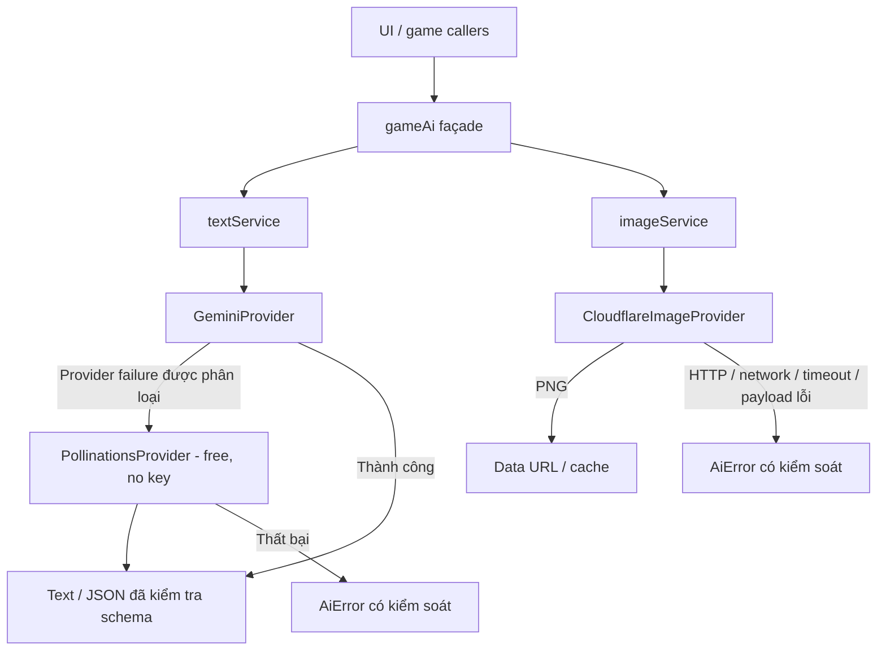

# Phase 2 — AI subsystem

Đã tách AI trong phạm vi subsystem và các caller liên quan. Không rewrite game logic, content system, save backend hay giao diện tổng thể. Các prompt và phép tính card/fusion/boss hiện có được giữ trong façade, không chuyển vào provider.

## Kiến trúc AI mới

- `TextProvider.generateText(request, options, signal)` là interface chung. Request/schema không import Gemini SDK.
- Provider xử lý HTTP, parsing envelope và lỗi đặc thù. Gemini dùng REST `generateContent`; Pollinations dùng endpoint free hiện có trong repo, không key, không proxy.
- Text service chọn provider theo config/factory, validate input/schema, quản lý deadline/abort, normalize text/JSON, kiểm tra kiểu và trường bắt buộc, rồi quyết định fallback.
- Image provider có interface riêng, không import text service. Image service validate request, quản lý timeout/cancel, cache/deduplicate theo prompt/dimensions/seed và chuyển PNG thành data URL.
- Image prompt được dựng từ nội dung, art style, concept, giới tính/faction và lens hiện có; không gọi text AI để tối ưu prompt nữa.
- Provider có thể thay bằng implementation khác qua constructor injection; caller không cần biết SDK/HTTP của provider.
- `status.ts` quản lý lifecycle theo request; một request hoàn tất không đưa monitor về Idle khi request khác còn chạy. Không còn cooldown Gemini dùng chung mọi key.

## Module mới

Tất cả dưới `src/services/ai/`, tên camelCase theo convention TypeScript hiện có:

| File | Vai trò |
|---|---|
| `config/aiConfig.ts` | Provider, endpoint, model, timeout, fallback flag, kích thước ảnh/cache; danh sách model cho UI |
| `text/provider.ts` | TextProvider, request/options, schema trung lập |
| `text/geminiProvider.ts` | Gemini REST adapter; schema mapping và error classification |
| `text/pollinationsProvider.ts` | Pollinations free adapter, không gửi credential |
| `text/textService.ts` | Lựa chọn provider, fallback, input/output validation, normalization |
| `image/provider.ts` | ImageProvider và ImageRequest riêng |
| `image/cloudflareImageProvider.ts` | Adapter đúng contract Worker đã cung cấp |
| `image/imageService.ts` | Timeout/cancel, data URL, bounded cache, deduplication |
| `errors.ts` | AiError và chuẩn hóa lỗi HTTP/network/body |
| `timeout.ts` | Deadline bao gồm request, body và normalization; AbortController + Promise.race |
| `status.ts` | Trạng thái request đồng thời và bridge event cho ApiMonitor |
| `gameAi.ts` | Façade giữ prompt/game rules, gọi text/image service |
| `index.ts` | Entry point cho caller và các interface service |

Thêm `ai-regression.test.ts`, script `npm run test:ai`, `phase2-browser-regression.py` và báo cáo này. Không thêm dependency mới; `tsx` đã có trong repo.

## Module cũ

**Đã xóa khỏi implementation:**

- Networking, provider orchestration, shared-key cooldown và cache trong monolith AI cũ.
- Pollinations custom-key/proxy tiers, image endpoints Pollinations và proxy Worker cũ.
- Gemini SDK imports và dependency `@google/genai`; Gemini adapter mới dùng REST.
- Gemini Vision gọi SDK trực tiếp; Vision hiện qua text interface với inline image.
- Text AI auto-refinement trong image generation và boss cache localStorage theo key quá thô.
- Build-time `process.env.GEMINI_API_KEY` injection trong Vite.
- UI timer tự ép API Idle sau 15 giây và check provider giả trong Campaign.

**Giữ compatibility:**

- `src/services/ai.ts` chỉ còn re-export subsystem mới và các hàm roll cũ. Không chứa request/provider/cache logic. Không còn production caller import đường dẫn này; giữ cho code dùng public import path cũ.
- Tên/signature các hàm `generate…FromAI` được giữ. `overrideModel` của ảnh là tham số compatibility, không thể đổi model cố định bên Worker.
- Các trường đã lưu `useCustomGemini`, `pollinationsKey`, `defaultImageModel` được giữ để không đổi save schema. Hai trường đầu không điều khiển provider mới; Pollinations key cũ không được đọc/gửi. Gemini luôn primary khi có runtime key; Image Worker luôn dùng model đã triển khai.
- `GlobalApiState` giữ API event bridge cho monitor; `geminiBannedUntil` chỉ còn field compatibility giá trị 0.

**Chưa xóa:** game prompt/content façade và compatibility shim được giữ có chủ đích; không có implementation provider cũ đang chạy. Giá trị boss cache cũ trong save không được dùng nữa; không xóa save ngoài phạm vi AI.

## Caller đã migrate

Trước đây các caller gọi monolith `src/services/ai.ts`; nay gọi façade `src/services/ai/index.ts`:

| Caller | Luồng |
|---|---|
| `src/App.tsx` | AI Vision/alt text |
| `src/components/FullCard.tsx` | Translation, Holocomm/dialogue |
| `src/views/ExtractView.tsx` | Tạo card + ảnh |
| `src/views/FusionView.tsx` | Tạo nội dung fusion + ảnh |
| `src/views/AscensionView.tsx` | Tạo nội dung ascension + ảnh |
| `src/views/CombatView.tsx` | Boss, ảnh boss, dialogue |
| `src/views/CampaignView.tsx` | Scenario + ảnh background |
| `src/views/StudioView.tsx` | Photoshoot |

`ApiMonitor.tsx` đọc status bridge riêng. `useGameState.ts` đọc rollFaction/rollElement từ `gameLogic.ts`, không còn kéo AI subsystem vào persistence. Hai hàm roll được di chuyển nguyên trạng, không đổi xác suất.

Các sửa trực tiếp liên quan AI result:

- Holocomm dùng card gốc để lưu, không lưu bản đã merge translation; dùng card hiện tại khi response về để giữ cập nhật song song. Enter/Send dùng chung handler, có guard request đang chạy và epoch/unmount.
- Translation chờ lưu thành công mới trừ phí; response cho card đã đóng/chuyển không được áp vào card khác.
- Alt text và Studio merge kết quả vào card hiện tại thay vì snapshot trước request. Studio báo lỗi/hoàn dust qua handler hiện có nếu card không còn để lưu.
- Settings hiển thị runtime Gemini key/model và model Cloudflare đúng với Worker; không còn lựa chọn Pollinations key/image model không được hỗ trợ. Không redesign UI.

## Fallback

Gemini -> Pollinations Free khi và chỉ khi thất bại được phân loại là provider failure và `fallbackEnabled = true`:

- Không có runtime Gemini key: Gemini không khả dụng, chuyển free fallback mà không gửi request Gemini.
- Network/fetch failure.
- Timeout của Gemini, kể cả response body treo; abort request trước khi fallback.
- HTTP 401, 403, 404, 408, 429, hoặc 5xx.
- HTTP 400 có thông báo API key không hợp lệ; HTTP 400 request/schema lỗi thông thường **không** fallback.
- Response không có text, envelope/JSON hỏng hoặc JSON không khớp schema yêu cầu. Đây là vi phạm output contract của provider, được phân biệt với input/application error.

Không fallback với input/schema/options không hợp lệ, exception logic application không phải AiError provider failure, caller cancellation hoặc safety/content refusal của Gemini.

Không truyền Gemini key/model hay Pollinations key cũ sang fallback. Pollinations dùng model free trong config và chỉ gửi `Content-Type: application/json`.

Nếu fallback cũng thất bại: service trả `AiError('ALL_PROVIDERS_FAILED')`, chứa các nguyên nhân đã phân loại và message an toàn. Caller xử lý bằng toast/dialog/narrative fallback hiện có. Dialogue tùy chọn vẫn có câu thoại tĩnh khi AI không khả dụng; các luồng cần dữ liệu thật không giả kết quả thành công.

**Vision:** Gemini nhận inline image qua cùng text interface. Contract Pollinations free hiện được xác định cho text; adapter không âm thầm bỏ image và bịa alt text. Nếu Gemini Vision thất bại, kết quả là lỗi có kiểm soát khi fallback không hỗ trợ inline image. Không tự chọn provider Vision khác.

**Image:** chỉ Cloudflare Worker, không fallback sang provider ảnh khác. Khi lỗi, service reject AiError và UI xử lý lỗi; Studio giải phóng processing/hoàn phí. Không phát sinh text request để cứu luồng ảnh.

## Configuration

`src/services/ai/config/aiConfig.ts` là nguồn public config:

- Text primary Gemini, fallback Pollinations, model Gemini mặc định `gemini-3-flash-preview`, free model `openai`.
- Gemini endpoint `https://generativelanguage.googleapis.com/v1beta/models`.
- Pollinations free endpoint `https://text.pollinations.ai/openai` kế thừa từ repo.
- Timeout: Gemini 15s, Pollinations 25s, Image Worker 60s. Mỗi attempt có deadline riêng, không có retry vòng lặp vô hạn.
- Image endpoint `https://flat-bush-389f.spritenguyen.workers.dev/`.
- Image model `@cf/black-forest-labs/flux-2-klein-4b`, cố định bên Worker; config client là metadata cho UI, không gửi model override.
- Preset kích thước giữ luồng ratio hiện có: 1024x1024, 768x1344, 1920x1080; cache tối đa 32 entry.

API key do người dùng nhập runtime trong Settings. Không commit key và không đưa system key từ env vào JS bundle. `.env.example` cập nhật hướng dẫn; Vite không còn `define` Gemini secret. Cơ chế lưu config hiện có vẫn ở localStorage; chưa tạo backend/proxy credential mới trong phase này.

## Contract Cloudflare Worker

Đã đối chiếu mã Worker người dùng cung cấp trước implementation:

- URL root, HTTP **POST**.
- Header `Content-Type: application/json`; không Authorization/API key.
- Body `{ prompt, width, height, seed? }`; không gửi model.
- Worker trim prompt, mặc định width/height 1024; gọi `env.AI.run` với multipart cho model cố định.
- Thành công: binary PNG, `Content-Type: image/png`, `Cache-Control: no-store`.
- Lỗi: JSON `{ error, detail?, result? }`; 400 thiếu prompt, 405 sai method, 500 lỗi generation/no image.
- CORS: POST/OPTIONS, Content-Type, origin `*`.

Adapter kiểm tra status, MIME và chữ ký PNG; không lưu JSON/HTML trả lỗi thành ảnh. Chi tiết lỗi nội bộ Worker không được đẩy thẳng ra message UI. Toàn bộ HTTP contract nằm trong adapter nên có thể thay mà không sửa domain/UI.

## Test/validation đã chạy

| Kiểm tra | Kết quả |
|---|---|
| `npm run test:ai` | **36 PASS**, transport được mock, không gọi/bill provider thật |
| `python phase2-browser-regression.py` | **7 nhóm PASS**, không pageerror; façade tất cả luồng text, image không gọi text, lỗi cả hai provider, Holocomm/Studio và response muộn |
| `python phase1-regression.py` | **14 nhóm PASS**, không pageerror sau migration |
| `npm run lint` | **PASS**, script hiện là `tsc --noEmit` |
| `npm run build` | **PASS**; không có lỗi build do migration |
| Build với Gemini env sentinel, kiểm tra toàn bộ `dist` | **PASS**, sentinel không xuất hiện trong assets |
| Production preview smoke | **12 tab**, HTTP 200, không pageerror |
| `git diff --check` | **PASS** |
| Tìm import/provider/endpoint cũ | Không còn SDK, proxy tiers, image Pollinations, env Gemini injection hay production import monolith |

Các nhánh tối thiểu đều đã kiểm tra: Gemini success; HTTP/network failure -> fallback; Gemini timeout -> fallback; cả hai fail -> controlled error; Worker PNG success; Worker HTTP/network body/timeout/payload lỗi -> controlled error. Có test input/logic/safety/cancel không fallback, không truyền secret sang fallback, cache không lưu lỗi và nhiều request không reset status sai.

Build còn cảnh báo bundle >500 kB và entry AI vừa static/dynamic import từ trước. Không tách toàn bộ bundle trong Phase 2.

**Giới hạn live validation:** không có Gemini key thật được cung cấp để test live. Truy cập Worker từ môi trường trả proxy CONNECT 403; thử trực tiếp không resolve được DNS. Contract được xác minh từ mã Worker đã cung cấp; thành công/lỗi runtime của các provider được kiểm tra bằng transport mock. Chưa xác minh tình trạng triển khai/quota/model/latency của Gemini, Pollinations free và Worker thật.

## Rủi ro còn lại

- Endpoint/model của provider bên ngoài có thể thay đổi; free Pollinations không có SLA. Chưa có bằng chứng live trong môi trường này. Config/adapter cô lập các thay đổi đó.
- Vision fallback không có khả năng inline-image được xác minh cho free Pollinations; trả lỗi rõ ràng thay vì mô tả ảnh giả.
- Worker cố định model; đổi model phải thay deployment Worker. Các giới hạn dimension thực tế của model chưa test live, dù request contract đã rõ.
- Config/key runtime vẫn theo storage của app hiện tại. System-owned key cần server-side proxy để không đưa secret vào trình duyệt; không thêm backend trong phase này.
- JSON validation kiểm tra schema/type/required; không thay bộ quy tắc cân bằng, migration faction hoặc kiểm chứng mọi ngữ nghĩa của nội dung AI.
- Các metadata race được xử lý tại các caller đã sửa; chưa bảo đảm transaction field merge trên nhiều tab hoặc giữa localStorage/IndexedDB. Đây là vấn đề persistence toàn app.

## Việc nên xử lý ở Phase 3

- Thiết kế persistence/transaction chung và cơ chế cập nhật từng field an toàn trên nhiều tab; giữ danh sách schema/faction/material cũ của Phase 1.
- Tách Combat engine/UI/audio và bổ sung test luật game, không đưa việc đó vào AI provider.
- Backend quản lý system credential nếu sản phẩm cần key chung; deployment/quota/rate-limit Worker theo nhu cầu vận hành.
- Tách bundle, chuẩn hóa React typing/strict checks và test runner/browser CI toàn repo.
- Chốt progression Training/Splicing và các quy tắc content/balance chưa rõ, rồi mới điều chỉnh semantic validation tương ứng.

Dừng tại Phase 2: caller chính qua service, hai luồng text/image độc lập, fallback/error policy rõ, build và regression qua. Không commit, deploy, tạo PR hoặc refactor tổng thể.
