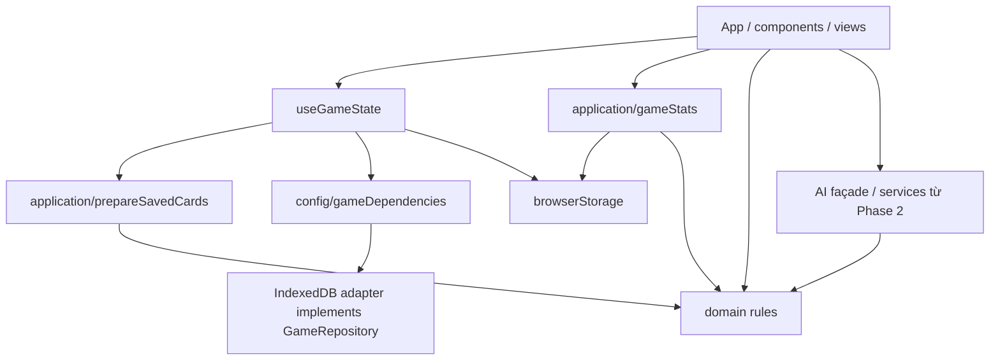

# Phase 3 — Refactor cấu trúc mã nguồn

## Phạm vi và kết quả

Refactor incremental từ trạng thái sau Phase 2. Giữ React/Vite, routing bằng tab,
React state, game rules, AI architecture/providers và schema save hiện tại.
Không thêm backend, không đổi cách cung cấp API key, không triển khai đồng bộ save
nhiều tab. Working tree vẫn chứa các thay đổi Phase 1/2; báo cáo này chỉ mô tả
phần Phase 3. Không commit, deploy hoặc tạo PR.

## Cấu trúc trước và sau

Trước:

- `lib/gameLogic.ts`: khoảng 1.010 dòng, trộn card/combat/equipment rules,
  đọc localStorage để tính skill bonus, và một helper Blob.
- `lib/constants.ts`: game metadata trộn với application defaults; việc import
  constants từ game logic kéo theo AI config.
- `lib/db.ts`: implementation IndexedDB, được App và state hook dùng trực tiếp.
- `useGameState`: React state + browser storage + legacy migrations + daily pools.
- `App`: import toàn bộ view ngay lúc khởi động; import AI đồng thời static/dynamic.

Sau:

```text
src/
  components/, views/               presentation, giữ cấu trúc UI hiện có
  hooks/useGameState.ts             React state và commit/sync state sau persistence
  application/
    ports/gameRepository.ts         hợp đồng persistence
    gameStats.ts                    cung cấp persisted skill context cho domain
    prepareSavedCards.ts            orchestration migration saved cards
  domain/
    cardRules.ts                    rank, roles, affinity, ultimate, economy, rolls
    combatRules.ts                  combat stats, enemy speed, squad synergy/dodge
    equipmentRules.ts               equipment stat modifiers và loot rolls
    gameRules.ts                    public domain exports
    gameConstants.ts                game metadata hiện có
    skills.ts                       skill tree và effects
    dailyActivities.ts              quest/expedition pools và generation
    inventory.ts                    legacy material migration
  infrastructure/storage/
    indexedDbGameRepository.ts      IndexedDB adapter, giữ nguyên transactions
    browserStorage.ts               browser adapter và tên khóa save tập trung
  config/
    appConfig.ts                    application defaults
    gameDependencies.ts             composition root, kết nối repository implementation
  services/ai/                      giữ subsystem Phase 2
  lib/                             compatibility exports và những module chưa cần đổi
  types.ts                         model/types trung lập, giữ đường dẫn hiện có
```



Domain không có runtime dependency tới React, browser storage, HTTP, application
hoặc AI providers. Application có thể tính stats với domain thuần mà không cần
browser. Composition root chọn implementation repository; port là type-only nên
không tạo vòng runtime. Không ép chuyển AI sang folder khác chỉ để đồng nhất tên.

## Module/file đã di chuyển

| Nguồn | Implementation sau refactor | Tương thích |
|---|---|---|
| `lib/gameLogic.ts` | `domain/cardRules.ts`, `combatRules.ts`, `equipmentRules.ts`, `gameRules.ts` | Giữ exports cũ tại `lib/gameLogic.ts`; 3 hàm phụ thuộc saved skills đi qua `application/gameStats.ts` |
| `lib/skills.ts` | `domain/skills.ts` | Giữ compatibility export |
| `lib/constants.ts` | `domain/gameConstants.ts`, `config/appConfig.ts` | Giữ compatibility exports, bao gồm `IMAGE_MODELS` từ AI config |
| `lib/db.ts` | `infrastructure/storage/indexedDbGameRepository.ts` | Giữ `DatabaseService` và cùng singleton `dbService` |
| Daily generators trong hook | `domain/dailyActivities.ts` | Pool, random shuffle, selection counts, ID/timestamp giữ nguyên |
| Inventory migration trong hook | `domain/inventory.ts` | Tên alias, cách cộng materials, defaults giữ nguyên |
| Card preparation trong hook | `application/prepareSavedCards.ts` | Giữ migration metadata và best-effort save; inject image URL creation |
| Đọc saved skills trong game logic | `application/gameStats.ts` + browser adapter | Caller UI giữ signature và kết quả; domain nhận skills tường minh |
| Polling DB status trong App | `useGameState` | Chu kỳ 1 giây, status và UI giữ nguyên |

Các caller App, card/combat components, views, hook và AI façade đã chuyển import
sang module trách nhiệm cụ thể. AI façade chỉ đổi đường dẫn domain/metadata import;
request, prompt, fallback, config và provider contract của Phase 2 giữ nguyên.

## Module/file mới

15 module source trong cây trên: 8 domain, 3 application, 2 infrastructure/storage,
2 config. Các artifact validation/báo cáo mới:

- `architecture-regression.test.ts`.
- `tests/fixtures/phase3-game-rules.json`: kết quả từ implementation trước Phase 3.
- `phase3-browser-smoke.py`.
- `PHASE3_REPORT.md`.

`phase1-regression.py` chỉ thay cách tìm singleton DB: import compatibility module
trực tiếp, không suy ra implementation import từ source của hook. Giữ toàn bộ
assertions và 14 nhóm regression.

## Module/file đã xóa

Không xóa đường dẫn source công khai. Các file legacy trở thành compatibility
exports; implementation chỉ tồn tại ở vị trí mới, không nhân đôi.

Xóa direct dependencies không có caller/server entry point: `express`, `dotenv`,
`@types/express`. Không thêm dependency mới. `base64ToBlob` hiện không có caller
production nhưng giữ nguyên trong compatibility module, tránh phá import bên ngoài.
Không tạo shared folder chỉ để chứa helper chưa được nhiều module sử dụng.

## Dependency được cải thiện

- Game constants không import AI config; domain không bị kéo theo provider/config.
- Domain combat nhận `unlockedSkills` thay vì tự đọc localStorage.
- Application façade cung cấp saved skills, gồm cách bỏ qua dữ liệu malformed cũ.
- Adapter IndexedDB implement `GameRepository`; hook lấy instance qua composition root.
- Saved-card preparation phụ thuộc đúng `Pick<GameRepository, 'saveCard'>`, image URL
  callback được inject; không phụ thuộc component hay concrete IndexedDB adapter.
- App không đọc adapter DB trực tiếp. Hook trả database status cho presentation.
- Browser save keys của hook/i18n/gameStats tập trung tại `browserStorage.ts`.
- Runtime graph được kiểm tra bằng TypeScript emitted imports, gồm dynamic imports:
  không có unresolved internal imports hoặc circular dependencies. Không phát hiện
  vòng import có sẵn cần sửa; kiểm thử bảo vệ việc phát sinh vòng mới.

## Duplicate/dead code đã xử lý

- Hợp nhất đọc/parse persisted skills thay cho hai đoạn localStorage trong game rules.
- Implementation domain/storage không còn nằm song song ở legacy paths.
- Loại bỏ unused imports `FusionView`, `generateImageFromAi` trong App và unused
  `GameState` type trong hook.
- Loại bỏ direct server dependencies không dùng như trên.
- Alt-text import dùng cùng static AI façade với các caller hiện tại, hết cảnh báo
  cùng module bị import static và dynamic.

## Loading và bundle

Giữ ExtractView eager cho tab mặc định. 13 view còn lại dùng `React.lazy`, named
exports được adapter sang default chỉ tại App, `Suspense` đặt trong panel hiện có.
Không đổi route, props, tab mount/unmount lifecycle sau load hay thiết kế UI.

| Build cùng môi trường | Trước Phase 3 | Sau Phase 3 |
|---|---:|---:|
| Entry JavaScript, minified | 1.836,63 kB | 1.484,00 kB |
| Entry gzip | 423,80 kB | 345,37 kB |
| Lazy view chunks | 0 | 13 |

Entry giảm khoảng 19%; đây là lượng tải khởi động, không phải giảm tổng code của
application. Chunk lớn vẫn được Vite cảnh báo. `Icon` truy cập động namespace
`lucide-react`, nên giữ toàn bộ icon library để bảo toàn contract tên icon.
Không tăng `chunkSizeWarningLimit` hoặc thay mapping icon để che cảnh báo.

## Behavior compatibility

Đã kiểm tra:

- 52 kết quả card combat stats, 4 squad aggregates và 4 dodge rates từ code cũ,
  gồm equipment, genes, resonance, rank, faction/element, skill bonuses và malformed skills.
- 36 equipment rolls dùng RNG seed cố định: giữ drop chance, rarity, stats, IDs
  và thứ tự tiêu thụ random numbers; 7 trường hợp rank/dismantling economy.
- Inventory alias migration không mất/nhân đôi materials; migration lặp giữ counts.
- Daily quest/expedition counts, rewards, timestamp IDs, initial state.
- Card metadata migration, best-effort persistence failure và image URL adapter.
- IndexedDB version 4, store names, transaction atomicity, rollback và save keys.
- StrictMode hydration; zero balance; card/squad/fusion reference synchronization;
  equip/swap/unequip; extraction, crafting, splice, Phantasm, combat và reset.
- AI façade/provider fallback, chat, translation và image error/refund/concurrent updates.
- Production navigation và lazy loading với external requests bị block.

## Test/build đã chạy

| Kiểm tra | Kết quả |
|---|---|
| `npm run lint` (`tsc --noEmit`) | Pass |
| `npm run build` sau từng cụm | Pass; vẫn có cảnh báo chunk >500 kB |
| `npm run test:architecture` | 8 tests pass |
| `npm run test:ai` | 36 tests pass |
| `python phase1-regression.py` | 14 nhóm pass, không page error |
| `python phase2-browser-regression.py` | 7 nhóm pass, không page error |
| Production smoke cũ | 12 tab pass, không page error |
| `python phase3-browser-smoke.py` | 14 tab render pass, 1 initial JS chunk → 14 chunks sau navigation; revisit cached; không page error |
| `git diff --check` | Pass sau chỉnh whitespace |

Để chạy browser suites: cần Python Playwright, Chromium và Vite dev port 3000.
Smoke Phase 3 cần build + Vite preview port 3001; cho phép override
`GAME_PREVIEW_URL` và `CHROMIUM_PATH`. Fixture card chỉ được ghi vào browser
context kiểm thử riêng. Không gửi request provider thật. Không có live validation
Gemini/Pollinations/Worker mới trong Phase 3.

## Regression risks

- Tab lazy cần tải chunk lần đầu: trên mạng chậm có thể chờ trước khi panel hiện;
  asset deployment thiếu/mất chunk vẫn có thể gây lỗi tải module. Chưa thêm cơ chế
  retry/offline UX vì đây là thay đổi hành vi ngoài phạm vi refactor.
- Stats application façade vẫn đọc saved skills như trước; không chuyển sang live
  React context để tránh đổi thời điểm áp dụng bonus.
- Legacy faction migration vẫn random và best-effort persistence, đúng behavior cũ.
- Game save nhiều tab và credentials client-side vẫn theo cơ chế hiện có.
- App/CombatView/FullCard vẫn có orchestration lớn; chưa đạt tách tuyệt đối mọi UI
  business rule. Tách đồng loạt các state machines này sẽ tăng rủi ro regression.
- Các khóa UI preference/cooldown/navigation còn trong một số view; không tuyên bố
  đã cô lập tất cả browser side effects trong toàn project.

## Future architecture improvements — chỉ đề xuất

1. **Credentials phía server:** cần backend/proxy deployment, authentication,
   ownership/quota và secret configuration. Không thể đổi storage key sang server
   mà vẫn giữ nguyên flow client hiện tại; không triển khai trong phase này.
2. **Save nhiều tab:** thiết kế version/conflict policy, atomic resource operations
   và synchronization channel trước khi thêm BroadcastChannel/storage listener.
   Listener đơn thuần không giải quyết lost updates trên currency/inventory/card.
3. **Icon registry:** định nghĩa contract icon names và migration list rõ ràng,
   sau đó cân nhắc explicit imports/tree shaking. Không mất khả năng render tên
   icon động hiện có chỉ để giảm bundle.
4. **Combat/application use cases:** tách simulation, reward commit và state machine
   từng bước với fixture combat sâu hơn; không rewrite CombatView.
5. **Các UI AI workflows lớn:** cân nhắc application use cases cho chat/translation/
   studio với transaction semantics, giữ lifecycle guards đã có ở Phase 2.
6. **Persistence hook:** port hóa profile storage và type hóa quests/expeditions khi
   đã thống nhất legacy content types; chưa đổi save schema hoặc reset semantics.
7. **Deployment assets:** versioned immutable chunks và kiểm thử stale-client deploy
   trước khi thêm retry/loading UX cho lazy views.

Dừng tại đây vì các cụm trách nhiệm và dependency đã rõ hơn, build/regression vẫn
hoạt động; các thay đổi lớn còn lại cần contract và validation sâu hơn.
